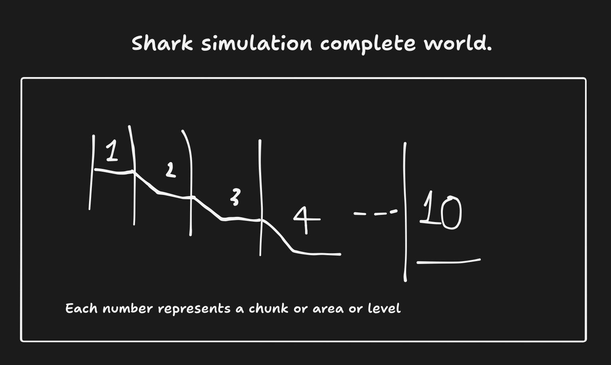
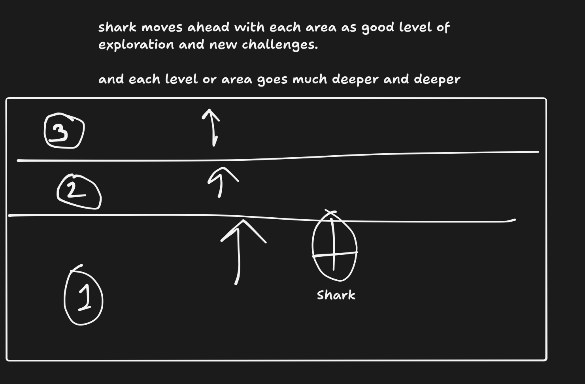

# System: world levels, streaming & the chart

> First of the per-system design docs. Owner doc for everything about how the
> world is divided, how it loads, and how the player navigates it. See
> [ROADMAP.md](../ROADMAP.md) §2 for how this fits the game as a whole.
>
> **Status: levels 1–2 built. Everything else is design.**
> Built — the level registry (`config.js` `LEVELS`), the continuous floor and the
> play bound (`src/levels.js`), the canyon, per-level scatter/shoals/orbs, the
> shark spawning in the shallows. Not built — streaming, levels 3–10, the chart,
> dispositions. §10 records exactly what shipped and what it cost.

---

## 1. The shape of the world

The ocean is a **corridor of 10 levels laid end to end**. Swimming forward carries
you into the next level, and every level's floor sits deeper than the last.

*Side elevation. Each numbered region is one level; the vertical lines are the
boundaries between them; the floor steps down at every one.*

*The same world from the player's side. Moving ahead means crossing into the next
area, and each area goes deeper than the one behind it.*

Level 1 is the current game — the reef the shark starts on. Level 10 is the floor
of the deepest trench on earth.

### The rule that makes it feel like one ocean

The levels are a **build and render partition, not a world partition.**

Concretely: `seabedHeight(x, z)` stays a single global, continuous function over the
whole 10-level run, with the descending profile baked into it. A "level" is only a
statement about *which slice of that function currently has a mesh built for it*.

This matters more than any other decision in this document. If each level owned its
own terrain function, the seams would have to be stitched, they would never quite
match, and the player would feel the joins — which is the exact failure the level
design is trying to avoid. With one continuous function, the boundary between
level 4 and level 5 is not a seam at all; it is just the place where the sand
happens to fall away.

---

## 2. Where this takes place

**The western Pacific, from Guam south-west to the Challenger Deep.**

The Mariana Trench runs along the eastern edge of the Mariana Islands, and the
Challenger Deep — the deepest known point on earth, ~10,935 m — sits at its
southern end, about **330 km south-west of Guam**. Level 1 is a Guam reef. Level 10
is the floor of the Challenger Deep. The corridor runs between them.

Setting it somewhere real costs nothing and pays for itself immediately: the
landmarks, the animals, the depths and the antagonist are all already written, and
they are stranger than anything worth inventing.

### The compression

Depth is **1:1 with reality**. Horizontal distance is not — 330 km of real ocean is
compressed to roughly 10 km of game, about 33×. That is the honest trade and it is
invisible in play, because at 50 m of visibility nobody is measuring the distance
between landmarks.

### Real anchors, level by level

Every one of these is a real place or a real animal, at roughly its real depth.

| # | Depth | Real anchor |
|---|---|---|
| 1 | 0–50 m | **Apra Harbor, Guam.** The *SMS Cormoran* (German raider, scuttled 1917) and the *Tokai Maru* (Japanese freighter, sunk 1943) lie touching each other at ~35 m — the only place on earth where a WWI and a WWII wreck rest in contact. |
| 2 | 50–200 m | Guam's fringing reef and the **shelf break**, where the volcanic arc's narrow shelf falls away. |
| 3 | 200–500 m | **Daikoku Seamount's molten sulfur pool**, ~414 m — one of very few known on the planet. |
| 4 | 500–1,000 m | The Mariana forearc's **serpentinite mud volcanoes**, where the subducting plate squeezes mud up through the crust. Found almost nowhere else. |
| 5 | 1,000–1,800 m | **NW Eifuku's "Champagne vent"**, ~1,600 m, venting droplets of *liquid* carbon dioxide. |
| 6 | 1,800–3,000 m | Open bathypelagic. ~2,000 m is the deepest a sperm whale dives — the last large familiar animal. |
| 7 | 3,000–4,000 m | The trench's outer wall. 3,675 m is the deepest shark ever recorded. |
| 8 | 4,000–6,000 m | The abyssal plain and the upper trench slope. |
| 9 | 6,000–8,000 m | The hadal zone. The **Mariana snailfish** (*Pseudoliparis swirei*), described from this trench in 2017, lives at 6,900–8,000 m. |
| 10 | 8,000–10,935 m | **The Challenger Deep.** **Xenophyophores** — single-celled organisms the size of your fist — were found here at 10,600 m. *Hirondellea gigas* amphipods swarm the floor. |

### Human traces, all real

- **Trieste**, 23 January 1960 — Piccard and Walsh, the first crewed descent.
- **Deepsea Challenger**, 2012 — Cameron's solo dive.
- **Limiting Factor**, 2019 onward — Vescovo's repeat descents.
- **Kaikō**, the Japanese ROV that first reached the Challenger Deep in 1995, was
  lost at sea in 2003 when its cable parted. Not in the trench itself — but the
  precedent is real, and machines sent down there do not all come back.

### The antagonist is already true

Two documented facts do the work an invented monster could not:

- **A plastic bag was photographed at 10,898 m in this trench.** The deepest place
  on earth already has our rubbish in it.
- **Amphipods from the Mariana Trench carry PCB contamination** at levels
  comparable to some of the most polluted rivers on earth (Jamieson et al., 2017).

Add to that the fact that the region is a **protected US marine monument** — the
Mariana Trench Marine National Monument, ~246,600 km², established 2009 — and that
seafloor mining at hydrothermal vents is a genuine live controversy in the Pacific,
and the villain writes itself: an operation working sulfide deposits in a place
where it has no legal right to be. No invented evil required; the game only has to
be accurate and let the player draw the conclusion.

### One caution

This is a real territory, a real protected area and a real community. Use the
geography, the wrecks and the science freely — that is what makes it feel true —
but invent the mining operator. Do not attach real companies, agencies or people to
fictional wrongdoing.

---

## 3. Real depths, real pressure

Numbers come from the real ocean wherever there is a real number to use. Two facts
carry most of the weight and both are simple enough for a player to internalise:

- **Pressure rises about 1 bar per 10 metres of seawater.** So depth in metres ÷ 10
  is the pressure in bar, plus the 1 bar of atmosphere at the surface. The HUD can
  show both and the player can check the arithmetic.
- **Sunlight is finished by about 1,000 m.** Photosynthesis effectively stops
  around 200 m; the last measurable photons are gone by 1,000 m. Below that the
  only light in the real ocean is light that living things make.

| # | Depth | Real zone | Light | Temp | Pressure |
|---|---|---|---|---|---|
| 1 | 0–50 m | Epipelagic — the reef | Full sun | ~24 °C | 1–6 bar |
| 2 | 50–200 m | Epipelagic — the shelf break | Blue, dimming | 18→12 °C | 6–21 bar |
| 3 | 200–500 m | Upper mesopelagic | 1% → 0.01% | 12→7 °C | 21–51 bar |
| 4 | 500–1,000 m | Lower mesopelagic | The last photons | 7→5 °C | 51–101 bar |
| 5 | 1,000–1,800 m | Upper bathypelagic | **None** | ~4 °C | 101–181 bar |
| 6 | 1,800–3,000 m | Bathypelagic | None | ~3 °C | 181–301 bar |
| 7 | 3,000–4,000 m | Lower bathypelagic | None | ~2.5 °C | 301–401 bar |
| 8 | 4,000–6,000 m | Abyssopelagic — the plain | None | ~2 °C | 401–601 bar |
| 9 | 6,000–8,000 m | Upper hadal — the trench | None | ~2 °C | 601–801 bar |
| 10 | 8,000–10,935 m | Hadal — the floor | None | 1–4 °C | 801–1,090 bar |

The bands are not equal thickness on purpose — the real ocean's zones aren't
either. Level 1 is 50 m thick and level 10 is nearly 3 km, which is exactly the
sense of scale opening up that the descent is for.

### Real facts that write the story for you

These come free with the accurate numbers, and they are better story beats than
anything invented:

- **Level 2, ~130–200 m: the continental shelf break.** In the real ocean this is
  where the seabed stops being a gentle slope and falls away. It is the first
  moment the world stops being a reef.
- **Level 5, ~1,000 m: the last light.** Everything below is lit only by things
  that are alive. Sonar stops being a convenience here and becomes the only way to
  see.
- **Level 6, ~2,000 m: the deepest a sperm whale dives.** The last level where you
  can meet a whale. After this, nothing large and familiar comes with you.
- **Level 7, ~3,675 m: the deepest shark ever recorded** — a Portuguese dogfish.
  **This is the end of the real world for your species.** Levels 8, 9 and 10 are
  past anything a shark has ever done. The story's turn is sitting right there in
  the data, and it costs nothing to use.
- **Level 8: the abyssal plain**, which covers more than half of the planet's
  surface and which almost no one has seen.
- **Levels 9–10: the end of vertebrate life.** The deepest fish ever filmed was a
  snailfish at 8,336 m — that record is from the Izu-Ogasawara Trench off Japan;
  the Mariana's own deepest, *Pseudoliparis swirei*, reaches about 8,000 m. Either
  way, below roughly 8.3 km there are no vertebrates at all. On the true floor
  there is nothing with a backbone except you — and the thing you came for.

### Where accuracy has to give way

Depth is real. **Horizontal distance is not**, and shouldn't be: real ocean basins
are hundreds of kilometres across and there is no game in that. Levels are sized
for play (below), and the descent between them uses real bathymetry as licence —
shelf breaks and trench walls genuinely are steep, so a sharp drop at a boundary is
accurate, not a cheat.

---

## 4. Level size

### What exists today

| | Value |
|---|---|
| Playable box | `WORLD.half = 77` → **154 × 154 m**, 0.024 km² |
| Water column | seabed −15 to surface +18 = **33 m** |
| Corner to corner | 218 m — about **18 seconds** at cruise (12.2 m/s) |
| Rendered sand & surface planes | 400 × 400 m — backdrop only; the shark is clamped to the 154 box |

The shark is 6 units nose to tail and a great white is 4.5–6 m, so **1 unit = 1
metre** and every number in this document is directly comparable to the real ocean.

Treating the 154 m box as one level is the right instinct with the wrong number.
Ten of them is a three minute game.

### What to size levels to

**Levels should not share one global constant.** Level 1 is a tutorial reef and
does not need to be big; level 10 is the floor of the Challenger Deep and cannot
afford to be small. A reasonable first pass:

| Levels | Footprint | Rationale |
|---|---|---|
| 1–2 | 400 × 400 m | Learn the verbs. Small enough to know by heart. |
| 3–5 | 800 × 800 m | Real exploration begins; the last of the light. |
| 6–8 | 1,200 × 1,200 m | Open dark water. Emptiness is the point. |
| 9–10 | 1,500 × 1,500 m | The trench. Should feel like it has no edges. |

That is roughly a **10 km forward run and about 11 km² of seabed**.

### Is that big enough?

Yes, comfortably. Subnautica's playable world is roughly 2 × 2 km (~4 km²) reaching
about 1,700 m, and it is not a world anyone describes as small. This design is
**~2.7× that footprint and ~6× the depth**, and with ~50 m of visibility perceived
size runs far ahead of measured size.

### The number that should actually worry you

11 km² is **around 460× the current world's area.** Every one of those square
metres needs props, creatures and a reason to be swum through. **An empty 15 km
ocean feels smaller than a dense 8 km one**, so treat these figures as a ceiling to
grow into rather than a target to hit early — and be willing to cut a level's
footprint in half if it is reading as empty.

### Why the area does not wreck performance

- **Draw cost barely moves.** Prop chunk culling means the GPU only ever sees what
  is inside the visibility radius, and that radius does not change when the level
  gets bigger. A bigger level costs *memory*, not *frame time*.
- **Memory is instanced matrices**, 64 bytes each. Even 50,000 scattered props is
  about 3 MB.
- **Unique geometry and textures are shared across every level** and never counted
  twice — see §5.

### One thing to decide early

The floor descends but the surface does not, so by level 10 there is nearly 11 km
of open water directly above the shark. That is realistic and mostly free to
render — there is nothing in it — but it needs a deliberate answer: is the playable
volume the whole column, or the few hundred metres near the floor with the rest
being empty dark you *can* swim up into but have no reason to? The second is
cheaper, more realistic and better paced.

---

## 5. Streaming: two levels resident, never more

### The resident set

At any moment the game holds:

1. **The level the shark is in.** Never evicted.
2. **At most one neighbour** — whichever boundary the shark is close enough to,
   forward or backward.

So the normal state is one level built, and two only while near a boundary.

### Thresholds, with hysteresis

| Constant | Value | Meaning |
|---|---|---|
| `preloadRadius` | 250 m | Within this of a boundary, the neighbour starts building |
| `evictRadius` | 400 m | Beyond this from a boundary, the neighbour is torn down |

The two numbers must differ. If loading and unloading trigger at the same
distance, a player hovering on the line builds and destroys a level every few
frames. The 150 m gap is the hysteresis that prevents it.

At cruise speed, 250 m is about **20 seconds of warning**. Level construction is
time-sliced across frames on a budget of roughly 4 ms per frame, so those 20
seconds offer around 1,200 frames of build time — vastly more than needed. The
player should never see a hitch, and never see a level pop in, because at ~50 m of
visibility they cannot see the far side of the boundary anyway.

### What actually loads and unloads

**Torn down when a level is evicted** — everything that is an *instance of* the
level:

- the terrain mesh and its geometry
- prop `InstancedMesh` objects and their chunk records
- fish schools, creatures, their `AnimationMixer`s
- orbs, level-local lights, particle emitters

**Never torn down** — everything *shared*:

- source GLB geometries, materials, textures, shaders
- the shark, the camera, the audio graph, the HUD

This split is the whole performance argument. Disposing and re-parsing GLBs at a
boundary would cause exactly the hitch the streaming exists to avoid, and would
churn the garbage collector every time the player paced back and forth over a
line. Loading a level should allocate almost nothing that wasn't already resident.

### What has to survive eviction

A small serialisable record per level, held for all 10 at all times. It is
kilobytes, not megabytes:

- which creatures are dead and their respawn timers
- which POIs, wrecks and artefacts have been collected
- which parts of the chart have been revealed
- any level-local story flags

Without this, swimming back into level 3 respawns everything you already cleared,
and the world stops being a place and becomes a set of rooms that reset.

### The boundary is level design, not a technical seam

Because only two levels are ever resident, the player must never be able to see
level 5 while standing in level 3. That is a **design** requirement before it is a
technical one, and the fix is to make every boundary a piece of geography that
occludes on its own:

- a shelf break you swim over the lip of
- a canyon mouth you pass through
- a trench wall you follow down

Combined with ~50 m of visibility, the player's sightline never reaches a boundary
they are not standing at. Done properly, nobody ever learns the world was built in
pieces.

---

## 6. Gating: difficulty, not doors

**Every level is physically reachable from the start.** Nothing is locked. What
stops a weak shark is that the things living down there will kill it.

This is the right call — it keeps the world honest and it means a bold or skilled
player can push deeper than they "should", which is one of the best feelings an
exploration game can give. But soft gating fails badly if it is not legible, so
three rules:

1. **Telegraph before you punish.** The level below should announce itself — a call
   you can hear from the boundary, a silhouette in the sonar return, the carcass of
   something bigger than you. The player must decide to enter, not discover on the
   way back that they were never going to survive.
2. **Death must read as "not yet", never as "unfair".** If a player dies to
   something they never saw and never heard, the gate has failed. If they die to
   something they watched kill a whale ten minutes earlier, it worked.
3. **Let skill beat the gate sometimes.** A careful player sneaking through level 7
   underlevelled should succeed. That is the reward for playing well, and it is
   what stops soft gating feeling like hard gating with extra steps.

Pressure fits the same model: below your rated depth, health drains and the screen
distorts. It is a countdown, not a wall — you can always dive past your rating, you
just cannot stay.

Each level gets an **apex** — one creature that owns it and that the player learns
to recognise before they learn to fight it.

---

## 7. The chart

An 8 km world with no landmarks and 50 m of visibility is unnavigable without a
map. It also happens to be the perfect place to hang the game's aesthetic.

### Form

An old sounding chart on aged paper — the kind a ship's navigator would have kept.
Yellowed stock, brown-black ink, hand-drawn contours, a compass rose, depth
soundings written in as numbers, and sea-monster marginalia in the empty places.

The marginalia are not decoration. Real charts genuinely drew speculative monsters
where the cartographer had no soundings, which makes them the most thematically
perfect fog-of-war treatment available: **unvisited levels are blank parchment with
a guess drawn on it.** What you have not explored is literally illustrated as
rumour, and it turns into real coastline as you go.

### View

The primary view is the **side elevation** — the cross-section from the first
sketch, all 10 levels descending left to right. That is the correct projection for
a vertical world, and it is what a sounding chart looks like anyway. A top-down
inset per level can come later if navigation within a level needs it.

### What it carries

- the 10 levels and their real depths, filled in as they are reached
- your current position and depth
- sanctuaries (respawn points), marked with an anchor
- wrecks, artefacts and POIs you have found
- recovered log fragments, readable from the chart itself

That last point earns the chart its place twice: it becomes the story artefact as
well as the navigation tool, so opening the map is how you read the game's fiction.

### Cost

None worth measuring. It is a DOM or 2D-canvas overlay drawn when opened, not per
frame, and it never touches the 3D scene.

---

## 8. Open decisions

| Question | Notes |
|---|---|
| Level footprint | 800 × 800 m proposed. Needs one afternoon of swimming around to feel out. |
| Vertical extent per level | Level 10 spans ~3 km of water column. Does the player use all of it, or is the interesting volume the bottom few hundred metres? |
| Boundary geometry | One reusable shelf-break template, or hand-built per boundary? Ten hand-built boundaries is ten memorable places; a template is a week's less work. |
| Does the corridor branch? | Currently a straight line. A single side-canyon per level would add exploration depth cheaply — worth prototyping once. |
| Backtracking incentive | If nothing pulls the player back up, levels 1–3 are dead content after an hour. Late-game reasons to return need designing. |

---

## 9. What is actually built (levels 1–2)

The first two levels ship as a **chain of basins**: the existing reef, unmoved, with
a new and much emptier plain up-Z from it and a canyon joining the two. Ten levels
of this shape are a string of basins linked by canyons, which is both real
bathymetry and a better fit for the radial placement this game already had than a
straight rectangular corridor would be.

### The numbers, as built

| | Value | Why |
|---|---|---|
| Level 1 "The Shallows" | centre (0, 0, **280**), floor **−15** | 33 m deep — inside the real 0–50 m band |
| Level 2 "The Reef" | centre (0, 0, **0**), floor **−50** | 68 m deep — the shallow end of the real 50–200 m band |
| Play bound | disc of r=**95** per basin | Not a box: a box of half-width 95 has corners at r=134, out past the peaks |
| Canyon | z ∈ [88, 197], x ∈ ±26 | The only route between the two |
| Ramp | z 190 → 95, −15 → −50 | 35 m of drop over 95 m of run, ~20° |
| Seabed mesh | 450 × 730, 41k tris | Was 400 × 400, 24k |

Levels descend in **−Z** because the shark's forward vector is (0, 0, −1): a player
who spawns in level 1 and holds W swims toward level 2. Level 3 goes at z = −280.

### The three things that make it read as one ocean

1. **One continuous floor.** `seabedHeight(x, z)` is `seabedBase(z) + dunes(x, z) *
   duneScale(z)`, and both `seabedBase` and `duneScale` are functions of z alone
   running through the same smoothstep. There is nothing to stitch, so there is no
   seam — the canyon floor is just where the sand happens to fall away.
2. **The plain really is a plain.** `duneScale` damps level 1's dunes to 0.35, and
   `PROPS_PLAIN` gives it about a fifth of the reef's props — no canopy, no
   mid-storey, no bones. That contrast is what makes level 2 land as a reef, and
   it is most of why two resident levels cost so little.
3. **A gap in the wall.** The mountain-ring prop row takes a `gap` half-angle,
   aimed at `LEVELS[n].gapDir`, so the peaks part at the canyon mouth instead of
   walling off the one way through.

### What had to change to allow a second basin

The world was radial and origin-anchored in more places than it looked. Everything
below now takes a centre or a bound:

- `clampRadius` gained a centre (defaulting to the origin, so level 2's callers
  read exactly as before); `planInstances`, `spawnPoint`, the shoal edge-turn and
  the orb scatter all measure from their level's centre.
- The shark's box clamp became `clampToWorld` — the union of both discs and the
  corridor. A box around two basins would have let you swim between them across
  open sand and never use the canyon.
- `columnY` became depth-aware, so a band stays a *fraction* of the water column.
  Level 2's column is twice level 1's, and not one species row needed an override.
- The backdrop sphere was radius 320 **at the origin**, and level 1's rim is at
  z=375 — you would have swum straight through it into the clear colour. It now
  centres on the play area and sizes itself from it.
- The seabed, the water surface, the particle field and the god rays all size or
  place themselves off `worldBounds()` / `LEVELS` rather than off constants.

### Bands are measured off the SEABED, not the water column

The first cut of the levels got this wrong and it is the most instructive mistake
in the system, so it is written down rather than quietly fixed.

Every `band` row — bait shoals, the named species, the whales, dolphins and
anglerfish — was a fraction of the water column. That was indistinguishable from
correct while every level had the same 33-unit column. The moment level 2's floor
dropped to −50 its column became 68, and **every animal in the game doubled its
height off the sand**: shoals cruising above the kelp instead of through it, whales
and dolphins up near the surface, anglerfish hovering over the reef they are meant
to be sitting in. The reef stopped reading as a reef.

Animals live at a height above the **floor**. So a band is now read against a fixed
reference span — `HABITAT`, 33 units, the column the game was originally tuned in —
which means every existing band row keeps precisely the height it was authored for,
at any depth, in every level that will ever be added.

| Band | Height above the floor |
|---|---|
| Bait shoals `FISH.band` | 5.9 – 27.1 |
| Blue fish | 2.0 – 9.2 |
| Clownfish | 0.7 – 5.9 |
| Whale | 13.9 – 25.7 |
| Dolphin | 16.5 – 31.3 |
| Anglerfish | 0.7 – 7.3 |

**The upper storey.** Holding animals to the habitat band leaves a deeper level's
extra water empty — 35 units of it above level 2. `FISH.highSchools` fills it with
bait shoals spawned between the top of the habitat band and just under the surface,
so the reef has two hunting heights and looking up from among the plants shows
shoals crossing overhead. Gated on `headroom() > highMinRoom`, so level 1 — whose
column *is* the reference span — gets none and stays a plain with its fish on the
sand.

### Landmarks are hand-placed

A prop row can carry a `fixed` array of level-local placements alongside (or
instead of) its scattered `count`. A world assembled only from statistics has no
landmarks in it, and a landmark is the one thing a scatter cannot produce — you
cannot ask a random ring for "two peaks flanking the canyon mouth".

The first use is **the gate**: four peaks framing the level 2 end of the canyon,
two a side, staggered in z so each side reads as a headland rather than a cone.
Their centres sit at r=112 and r=119, outside the play disc, so you can never get
inside one, while their feet reach into reachable water at the mouth — you squeeze
between them. The nearest collider edge is at x≈38, comfortably clear of the
canyon's ±26. The tallest is scale 1.42, which tops out ~3 units under the surface:
as large as a mountain can be on a floor at −50 without breaching.

The mountain ring's `gap` for level 2 was widened to 0.75 rad specifically to clear
random peaks out of the whole mouth, so these four define it on their own.

### Two rules taken from the real seabed

Both of these were got wrong first, and both are worth stating as rules because
they will keep applying as levels are added.

**1. Relief cannot exceed the water column.** A 33 m basin cannot hold a 60 m
mountain — it stands out of the sea. The first cut gave the shallows the reef's
mountain scales and every peak on its rim breached the surface by 27 units. So the
column is what sizes the scenery, not the other way round, and both levels were
deepened to buy room for it: **42 m in the shallows, 82 m on the reef**, still
inside their real bands (0–50 m and 50–200 m), leaving 40 units of drop through
the canyon. Any new mountain row has to satisfy
`targetSize × sMax − sink × sMax < column`.

Peaks are also **upright** (`tilt: 0`) and **sunk** (`sink: 3` per unit of scale).
A tilted peak reads as one falling over, and on the canyon's slope it read as one
already halfway down; real rock rises vertically whatever the ground beneath it is
doing. Sinking hides the gap a flat-bottomed model leaves on sloped sand, and is
what rock genuinely does — it comes up *through* sediment rather than sitting on it.

**2. The seabed is a mosaic, not a sprinkle.** This is the answer to "the world
feels like a large empty area", and nothing about it required more props.

Real seabeds are patchy: a seagrass meadow, then bare rippled sand, then a rocky
outcrop crusted with growth, then sand again. Equal-area sampling (`placement.js`)
fixed the opposite artefact — everything bunched at the origin — but what it
produces is *perfectly uniform* density, and uniform density at any density reads
as empty, because there is nowhere full to be and so nowhere looks like somewhere.

A prop row can now name a `clump`, and rows sharing a key share their patch
centres. Two substrates, because the sea has two:

| Patch set | Substrate | Rows |
|---|---|---|
| `REEF_PATCH` / `PLAIN_ROCK` | hard ground | outcrops, rubble, and everything that needs to hold onto something — kelp, ferns, anemones |
| `MEADOW` / `PLAIN_MEADOW` | soft ground | seagrass, which roots in open sand and does not want the rock |

That shared key is the substrate rule made mechanical: **kelp does not grow out of
open sand**, so the kelp rows draw from the rock rows' seeds and the forests end up
growing on the outcrops. One string does more for how natural the reef looks than
any amount of extra geometry. `frac` is held below 1 so a quarter of each row still
scatters and a patch frays into the sand instead of ending at a circle.

**3. A canyon has walls.** Two peaks at the entrance is a gap in a fence. The
corridor now has a line of mountains down each side, scales shrinking as the ramp
rises because the water above them gets shallower, with kelp stands on the
shoulders. Both mouths are dressed — the canyon has two ends and you arrive at
each of them.

### Known costs and soft spots

- **The seabed is one 41k-triangle mesh with a world-spanning bounding sphere**, so
  it is submitted every frame. Fine at two levels; it is the first thing that has
  to be split per level when streaming lands (§5).
- **Both levels are resident at all times.** Affordable now because level 1 is
  nearly empty, and prop chunk distance-culling already hides the far basin. It
  does not extend past three or four levels.
- **Level 1 has no creatures** — the whales, dolphins and anglerfish are level 2
  only. That is deliberate ("the big animals live deeper" is the first thing the
  descent should teach) but it means `nearestTracked` points at a whale 280 m away
  through a mountain while you are in the shallows.

---

## 10. Documentation convention

Every system gets a doc in `Docs/systems/`, written when the system is designed
rather than after it is built. Each one states: what the system is for, the numbers
it runs on and where they came from, what it costs, and what is still undecided.

Docs written so far:

- `world-levels.md` — this one. The *why*: the shape of the world and the design
  rules behind it.
- [`world-reference.md`](world-reference.md) — the *how*: every knob that controls
  the world, terrain and prop placement, what it does and what it breaks. Start
  here when you want to change something.
- [`placement-editor.md`](placement-editor.md) — the in-game F4 editor for
  hand-placing landmarks and clearing ground, and how its output gets into
  `config.js`.

Planned, as each is designed: `echolocation.md`, `dispositions.md`, `progression.md`,
`death-and-respawn.md`, `codex.md`, `story-spine.md`.
